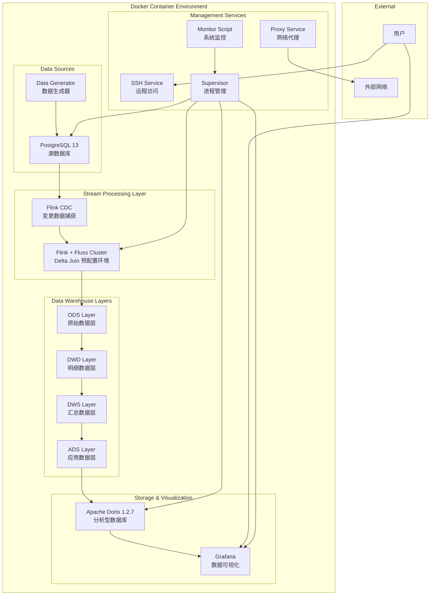
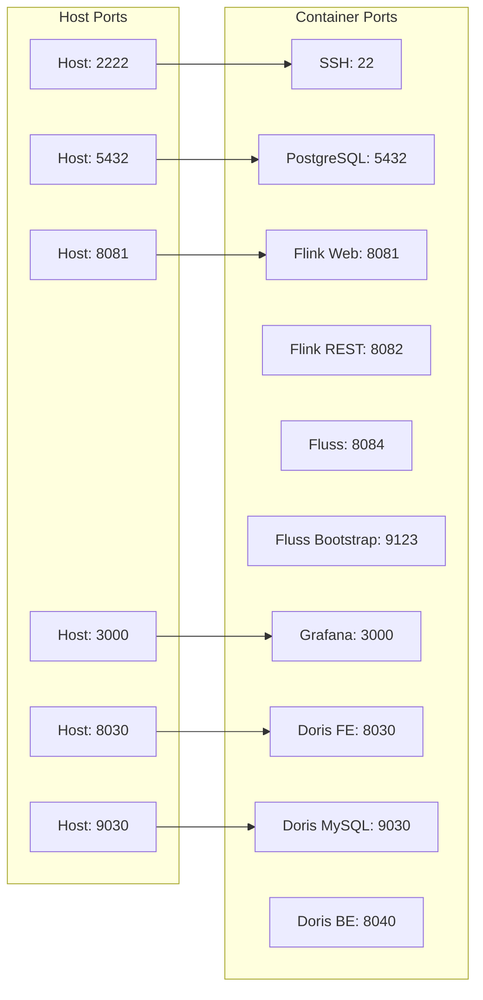

# Design Document

## Overview

国网实时数仓测试环境构建与验证系统是一个基于 Docker 容器技术的完整实时数据处理平台。该系统集成了 PostgreSQL、Apache Flink、Apache Fluss、Apache Doris 和 Grafana 等核心组件，实现了从数据源到数据可视化的端到端实时数据处理链路。

系统采用分层数仓架构（ODS → DWD → DWS → ADS），利用 Flink 2.2 的 Delta Join 算子结合 Fluss 流存储，实现了高效的流批一体化数据处理。通过 SSH 服务和代理配置，系统支持在各种网络环境中的部署和使用。

核心特性包括：
- 一键部署的 Docker 容器化环境
- 完整的实时数据仓库分层架构
- 基于 Delta Join 的高效流处理
- 端到端的数据流测试验证
- 可视化监控和运维管理

## Architecture

### 系统架构图



### 数据流架构

系统采用 Lambda 架构的简化版本，通过流处理实现实时数据仓库：

1. **数据源层**: PostgreSQL 存储国网业务数据，Python 脚本持续生成测试数据
2. **数据接入层**: Flink CDC 实时捕获数据库变更
3. **流处理层**: Flink 使用 Delta Join 算子进行流批一体化处理
4. **存储层**: Fluss 提供流存储，Doris 提供分析存储
5. **应用层**: Grafana 提供数据可视化和监控

### 网络架构



## Components and Interfaces

### 核心组件

#### 1. PostgreSQL 数据库
- **版本**: PostgreSQL 13
- **功能**: 源数据存储，支持 CDC 复制槽
- **配置**: 
  - 用户: postgres/postgres
  - 数据库: power_grid
  - 端口: 5432
- **表结构**: 设备信息、电表读数、告警信息、用户信息等

#### 2. Flink + Fluss 集成环境
- **基础镜像**: xuyangzzz/delta_join_example:1.0
- **Flink 版本**: Apache Flink 2.2.0
- **Fluss 版本**: Apache Fluss 0.8
- **功能**: 预配置的 Delta Join 环境，流数据处理
- **组件**:
  - JobManager: 作业调度和管理
  - TaskManager: 任务执行
  - Fluss Server: 流表存储
  - Web UI: 8081 端口
- **启动脚本**: start-flink-fluss.sh（来自基础镜像）

#### 3. Apache Doris 分析数据库
- **版本**: Apache Doris 1.2.7
- **组件**:
  - Frontend (FE): 查询解析和调度，端口 8030/9030
  - Backend (BE): 数据存储和计算，端口 8040
- **功能**: OLAP 查询，实时数据分析

#### 4. Grafana 可视化平台
- **功能**: 数据可视化，监控仪表板
- **端口**: 3000
- **认证**: admin/admin

### 接口定义

#### 1. Flink CDC 接口
```sql
-- PostgreSQL CDC Source
CREATE TABLE source_table (
  id BIGINT,
  name STRING,
  update_time TIMESTAMP(3),
  PRIMARY KEY (id) NOT ENFORCED
) WITH (
  'connector' = 'postgres-cdc',
  'hostname' = 'localhost',
  'port' = '5432',
  'username' = 'postgres',
  'password' = 'postgres',
  'database-name' = 'power_grid',
  'schema-name' = 'public',
  'table-name' = 'device_info'
);
```

#### 2. Fluss 表接口
```sql
-- Fluss 流表定义
CREATE TABLE fluss_table (
  id BIGINT,
  data STRING,
  event_time TIMESTAMP(3),
  PRIMARY KEY (id) NOT ENFORCED
) WITH (
  'connector' = 'fluss',
  'bootstrap.servers' = 'localhost:9123',
  'table.name' = 'power_grid.ods_device_info'
);
```

#### 3. Doris Sink 接口
```sql
-- Doris 结果表
CREATE TABLE doris_sink (
  id BIGINT,
  name STRING,
  value DOUBLE,
  create_time TIMESTAMP(3)
) WITH (
  'connector' = 'doris',
  'fenodes' = 'localhost:8030',
  'table.identifier' = 'power_grid_doris.device_summary',
  'username' = 'root',
  'password' = ''
);
```

## Data Models

### 源数据模型

#### 设备信息表 (device_info)
```sql
CREATE TABLE device_info (
    device_id BIGSERIAL PRIMARY KEY,
    device_code VARCHAR(50) UNIQUE NOT NULL,
    device_name VARCHAR(100) NOT NULL,
    device_type VARCHAR(50) NOT NULL,
    voltage_level VARCHAR(20),
    status VARCHAR(20) DEFAULT '运行',
    substation_id VARCHAR(50),
    location VARCHAR(200),
    create_time TIMESTAMP DEFAULT CURRENT_TIMESTAMP,
    update_time TIMESTAMP DEFAULT CURRENT_TIMESTAMP
);
```

#### 电表读数表 (meter_reading)
```sql
CREATE TABLE meter_reading (
    reading_id BIGSERIAL PRIMARY KEY,
    device_id BIGINT REFERENCES device_info(device_id),
    reading_time TIMESTAMP NOT NULL,
    active_power DECIMAL(10,2),
    voltage DECIMAL(8,2),
    current DECIMAL(8,2),
    power_factor DECIMAL(4,3),
    energy_consumption DECIMAL(12,2),
    data_quality VARCHAR(50) DEFAULT '正常',
    create_time TIMESTAMP DEFAULT CURRENT_TIMESTAMP
);
```

#### 告警信息表 (alarm_info)
```sql
CREATE TABLE alarm_info (
    alarm_id BIGSERIAL PRIMARY KEY,
    device_id BIGINT REFERENCES device_info(device_id),
    alarm_time TIMESTAMP NOT NULL,
    alarm_level VARCHAR(20) NOT NULL,
    alarm_type VARCHAR(50) NOT NULL,
    alarm_desc TEXT,
    alarm_value DECIMAL(10,2),
    threshold_value DECIMAL(10,2),
    status VARCHAR(20) DEFAULT '未处理',
    create_time TIMESTAMP DEFAULT CURRENT_TIMESTAMP
);
```

### 数仓分层模型

#### ODS 层数据模型
```sql
-- ODS 设备信息
CREATE TABLE ods_device_info (
    device_id BIGINT,
    device_code STRING,
    device_name STRING,
    device_type STRING,
    voltage_level STRING,
    status STRING,
    substation_id STRING,
    location STRING,
    update_time TIMESTAMP(3),
    PRIMARY KEY (device_id) NOT ENFORCED
) WITH (
    'connector' = 'fluss',
    'bootstrap.servers' = 'localhost:9123'
);

-- ODS 电表读数
CREATE TABLE ods_meter_reading (
    reading_id BIGINT,
    device_id BIGINT,
    reading_time TIMESTAMP(3),
    active_power DECIMAL(10,2),
    voltage DECIMAL(8,2),
    current DECIMAL(8,2),
    power_factor DECIMAL(4,3),
    energy_consumption DECIMAL(12,2),
    data_quality STRING,
    PRIMARY KEY (reading_id) NOT ENFORCED
) WITH (
    'connector' = 'fluss',
    'bootstrap.servers' = 'localhost:9123'
);
```

#### DWD 层数据模型
```sql
-- DWD 设备读数明细（关联后的宽表）
CREATE TABLE dwd_device_reading_detail (
    reading_id BIGINT,
    device_id BIGINT,
    device_code STRING,
    device_name STRING,
    device_type STRING,
    substation_id STRING,
    location STRING,
    reading_time TIMESTAMP(3),
    active_power DECIMAL(10,2),
    voltage DECIMAL(8,2),
    current DECIMAL(8,2),
    power_factor DECIMAL(4,3),
    energy_consumption DECIMAL(12,2),
    -- 派生字段
    power_status STRING,  -- 根据功率判断设备状态
    voltage_status STRING, -- 根据电压判断电压状态
    efficiency_score DECIMAL(5,2), -- 效率评分
    PRIMARY KEY (reading_id) NOT ENFORCED
) WITH (
    'connector' = 'fluss',
    'bootstrap.servers' = 'localhost:9123'
);
```

#### DWS 层数据模型
```sql
-- DWS 小时级设备汇总
CREATE TABLE dws_device_hourly_summary (
    window_start TIMESTAMP(3),
    window_end TIMESTAMP(3),
    device_id BIGINT,
    device_code STRING,
    substation_id STRING,
    -- 聚合指标
    total_energy DECIMAL(12,2),
    avg_power DECIMAL(10,2),
    max_power DECIMAL(10,2),
    min_power DECIMAL(10,2),
    avg_voltage DECIMAL(8,2),
    avg_current DECIMAL(8,2),
    reading_count BIGINT,
    abnormal_count BIGINT,
    PRIMARY KEY (window_start, device_id) NOT ENFORCED
) WITH (
    'connector' = 'fluss',
    'bootstrap.servers' = 'localhost:9123'
);

-- DWS 变电站级汇总
CREATE TABLE dws_substation_hourly_summary (
    window_start TIMESTAMP(3),
    window_end TIMESTAMP(3),
    substation_id STRING,
    -- 聚合指标
    total_energy DECIMAL(15,2),
    total_devices BIGINT,
    active_devices BIGINT,
    avg_load_rate DECIMAL(5,2),
    peak_power DECIMAL(12,2),
    PRIMARY KEY (window_start, substation_id) NOT ENFORCED
) WITH (
    'connector' = 'fluss',
    'bootstrap.servers' = 'localhost:9123'
);
```

#### ADS 层数据模型
```sql
-- ADS 实时设备监控
CREATE TABLE ads_device_realtime_monitor (
    device_id BIGINT,
    device_code STRING,
    device_name STRING,
    substation_id STRING,
    current_power DECIMAL(10,2),
    current_voltage DECIMAL(8,2),
    current_status STRING,
    health_score DECIMAL(5,2),
    last_update_time TIMESTAMP(3),
    -- 告警相关
    has_alarm BOOLEAN,
    alarm_level STRING,
    alarm_count_today BIGINT,
    PRIMARY KEY (device_id) NOT ENFORCED
) WITH (
    'connector' = 'doris',
    'fenodes' = 'localhost:8030',
    'table.identifier' = 'power_grid_doris.device_realtime_monitor'
);

-- ADS 异常告警分析
CREATE TABLE ads_alarm_analysis (
    alarm_id BIGINT,
    device_id BIGINT,
    device_code STRING,
    alarm_time TIMESTAMP(3),
    alarm_type STRING,
    alarm_level STRING,
    alarm_desc STRING,
    -- 分析字段
    is_frequent_alarm BOOLEAN,
    similar_alarm_count BIGINT,
    impact_level STRING,
    suggested_action STRING,
    PRIMARY KEY (alarm_id) NOT ENFORCED
) WITH (
    'connector' = 'doris',
    'fenodes' = 'localhost:8030',
    'table.identifier' = 'power_grid_doris.alarm_analysis'
);
```

### Doris 最终存储模型

```sql
-- Doris 中的设备实时监控表
CREATE TABLE device_realtime_monitor (
    device_id BIGINT,
    device_code VARCHAR(50),
    device_name VARCHAR(100),
    substation_id VARCHAR(50),
    current_power DECIMAL(10,2),
    current_voltage DECIMAL(8,2),
    current_status VARCHAR(20),
    health_score DECIMAL(5,2),
    last_update_time DATETIME,
    has_alarm BOOLEAN,
    alarm_level VARCHAR(20),
    alarm_count_today BIGINT
) ENGINE=OLAP
DUPLICATE KEY(device_id, last_update_time)
DISTRIBUTED BY HASH(device_id) BUCKETS 10
PROPERTIES (
    "replication_num" = "1",
    "storage_format" = "V2"
);

-- Doris 中的变电站汇总表
CREATE TABLE substation_summary (
    window_time DATETIME,
    substation_id VARCHAR(50),
    total_energy DECIMAL(15,2),
    total_devices BIGINT,
    active_devices BIGINT,
    avg_load_rate DECIMAL(5,2),
    peak_power DECIMAL(12,2)
) ENGINE=OLAP
DUPLICATE KEY(window_time, substation_id)
DISTRIBUTED BY HASH(substation_id) BUCKETS 5
PROPERTIES (
    "replication_num" = "1",
    "storage_format" = "V2"
);
```

## Correctness Properties

*A property is a characteristic or behavior that should hold true across all valid executions of a system-essentially, a formal statement about what the system should do. Properties serve as the bridge between human-readable specifications and machine-verifiable correctness guarantees.*

### Property 1: Service Management Consistency
*For any* container deployment, all required services (PostgreSQL, Flink, Fluss, Doris, Grafana, SSH) should be automatically started and managed by Supervisor, with each service maintaining its expected running state
**Validates: Requirements 1.2, 1.4, 9.1**

### Property 2: Network Service Accessibility  
*For any* deployed container, all exposed network services should be accessible on their designated ports and respond correctly to connection attempts
**Validates: Requirements 2.1, 5.5, 7.3**

### Property 3: Configuration Correctness
*For any* system configuration (proxy settings, SSH keys, database connections), the configuration should be properly applied and functional when tested
**Validates: Requirements 3.1, 3.2, 2.5, 4.5**

### Property 4: Data Generation Continuity
*For any* running data generator, it should continuously produce valid business data that gets successfully inserted into the source database
**Validates: Requirements 4.3, 4.4**

### Property 5: End-to-End Data Flow Integrity
*For any* data inserted into PostgreSQL, it should flow through all warehouse layers (ODS → DWD → DWS → ADS) and arrive in Doris with correct transformations applied
**Validates: Requirements 6.1, 6.2, 6.3, 6.4, 6.5, 7.2, 8.3**

### Property 6: Real-time Visualization Updates
*For any* data changes in the source system, the Grafana dashboards should reflect these changes within the expected time window
**Validates: Requirements 7.5**

### Property 7: System Health Monitoring
*For any* system component, the health check mechanisms should correctly detect service status and log monitoring results
**Validates: Requirements 8.4, 9.2, 9.3**

### Property 8: Automated Recovery Capability
*For any* service failure scenario, the system should automatically attempt to restart the failed service and restore normal operation
**Validates: Requirements 9.5**

### Property 9: Build and Deployment Consistency
*For any* image build process, it should produce a deployable container that passes all automated tests and includes all required components
**Validates: Requirements 10.2, 10.3**

## Error Handling

### 系统级错误处理

#### 1. 服务启动失败处理
- **检测机制**: Supervisor 进程监控，健康检查脚本
- **处理策略**: 
  - 自动重启失败的服务（最多3次）
  - 记录详细错误日志
  - 发送告警通知
- **恢复机制**: 
  - 依赖服务检查和级联启动
  - 配置文件验证和修复
  - 资源清理和重新初始化

#### 2. 网络连接错误处理
- **代理连接失败**: 
  - 自动切换到直连模式
  - 记录代理状态和错误信息
  - 提供手动代理配置选项
- **服务端口冲突**: 
  - 检测端口占用情况
  - 提供端口配置建议
  - 支持动态端口分配

#### 3. 数据处理错误处理
- **CDC 连接中断**: 
  - 自动重连机制（指数退避策略）
  - 断点续传支持
  - 数据一致性检查
- **流处理作业失败**: 
  - Flink 作业自动重启
  - Checkpoint 恢复
  - 错误数据隔离和处理

#### 4. 存储系统错误处理
- **PostgreSQL 连接失败**: 
  - 连接池管理和重试机制
  - 事务回滚和数据恢复
  - 备份数据验证
- **Doris 写入失败**: 
  - 批量写入重试
  - 数据缓存和延迟写入
  - 数据质量检查

### 应用级错误处理

#### 1. 数据质量问题
- **数据格式错误**: 
  - 数据验证和清洗规则
  - 错误数据标记和隔离
  - 数据修复建议
- **数据丢失检测**: 
  - 数据完整性校验
  - 缺失数据补偿机制
  - 数据血缘追踪

#### 2. 业务逻辑错误
- **计算结果异常**: 
  - 结果合理性检查
  - 历史数据对比验证
  - 异常值告警和处理
- **时间窗口处理错误**: 
  - 延迟数据处理策略
  - 窗口重计算机制
  - 时间同步检查

### 错误监控和告警

#### 1. 错误分级
- **Critical**: 系统无法正常运行（服务全部停止）
- **High**: 核心功能受影响（数据流中断）
- **Medium**: 部分功能异常（单个服务故障）
- **Low**: 性能下降或警告信息

#### 2. 告警机制
- **实时告警**: 关键错误立即通知
- **批量告警**: 非关键错误定期汇总
- **告警抑制**: 避免重复告警干扰
- **告警升级**: 未处理告警自动升级

#### 3. 错误恢复验证
- **恢复后验证**: 确保服务完全恢复正常
- **数据一致性检查**: 验证恢复过程中的数据完整性
- **性能基准测试**: 确保恢复后性能符合预期

## Testing Strategy

### 测试方法论

本系统采用双重测试策略，结合单元测试和属性测试，确保系统的正确性和可靠性：

- **单元测试**: 验证具体的功能点、边界条件和错误处理
- **属性测试**: 验证系统的通用属性和行为模式
- **集成测试**: 验证组件间的协作和数据流转
- **端到端测试**: 验证完整业务流程的正确性

### 测试环境配置

#### 1. 容器化测试环境
- **基础镜像**: 使用构建好的完整系统镜像
- **网络配置**: 独立的测试网络，避免端口冲突
- **数据隔离**: 每个测试使用独立的数据库和表空间
- **资源限制**: 合理的 CPU 和内存限制，模拟真实环境

#### 2. 测试数据管理
- **测试数据生成**: 自动化生成符合业务规则的测试数据
- **数据清理**: 测试完成后自动清理测试数据
- **数据备份**: 关键测试场景的数据快照
- **数据变异**: 生成边界值和异常数据进行测试

### 单元测试策略

#### 1. 服务组件测试
```python
# 示例：PostgreSQL 连接测试
def test_postgresql_connection():
    """测试 PostgreSQL 数据库连接"""
    conn = get_postgresql_connection()
    assert conn is not None
    assert conn.is_connected()
    
def test_postgresql_crud_operations():
    """测试基本 CRUD 操作"""
    # 插入测试数据
    device_id = insert_test_device()
    assert device_id is not None
    
    # 查询测试数据
    device = get_device_by_id(device_id)
    assert device is not None
    
    # 更新测试数据
    update_device_status(device_id, "维修")
    updated_device = get_device_by_id(device_id)
    assert updated_device.status == "维修"
    
    # 删除测试数据
    delete_device(device_id)
    deleted_device = get_device_by_id(device_id)
    assert deleted_device is None
```

#### 2. 配置验证测试
```python
def test_ssh_configuration():
    """测试 SSH 配置"""
    # 测试密码登录
    ssh_client = connect_ssh_password("root", "root123")
    assert ssh_client.is_connected()
    
    # 测试密钥登录
    ssh_client = connect_ssh_key("/root/.ssh/id_rsa")
    assert ssh_client.is_connected()
    
def test_proxy_configuration():
    """测试代理配置"""
    # 检查环境变量
    assert os.getenv("HTTP_PROXY") is not None
    assert os.getenv("HTTPS_PROXY") is not None
    
    # 测试代理连接
    response = requests.get("https://httpbin.org/ip", 
                          proxies=get_proxy_config())
    assert response.status_code == 200
```

#### 3. 数据流测试
```python
def test_flink_cdc_connection():
    """测试 Flink CDC 连接"""
    # 检查 CDC 作业状态
    jobs = get_flink_jobs()
    cdc_jobs = [job for job in jobs if "cdc" in job.name.lower()]
    assert len(cdc_jobs) > 0
    assert all(job.status == "RUNNING" for job in cdc_jobs)

def test_data_warehouse_layers():
    """测试数仓分层"""
    # 插入源数据
    test_data = generate_test_device_data()
    insert_source_data(test_data)
    
    # 等待数据流转
    time.sleep(10)
    
    # 验证 ODS 层
    ods_data = query_ods_layer(test_data.device_id)
    assert ods_data is not None
    
    # 验证 DWD 层
    dwd_data = query_dwd_layer(test_data.device_id)
    assert dwd_data is not None
    assert dwd_data.device_type == test_data.device_type
    
    # 验证 DWS 层
    dws_data = query_dws_layer(test_data.substation_id)
    assert dws_data is not None
    
    # 验证 ADS 层
    ads_data = query_ads_layer(test_data.device_id)
    assert ads_data is not None
```

### 属性测试策略

#### 1. 属性测试配置
- **测试框架**: 使用 Hypothesis (Python) 进行属性测试
- **测试迭代**: 每个属性测试至少运行 100 次
- **数据生成**: 智能生成符合业务约束的测试数据
- **失败分析**: 自动缩小失败案例，便于调试

#### 2. 核心属性测试
```python
from hypothesis import given, strategies as st

@given(st.integers(min_value=1, max_value=1000))
def test_service_management_consistency(device_count):
    """
    属性测试：服务管理一致性
    Feature: power-grid-realtime-warehouse, Property 1: Service Management Consistency
    """
    # 启动系统
    system = deploy_container()
    
    # 验证所有服务都在运行
    services = ["postgresql", "flink", "fluss", "doris", "grafana", "ssh"]
    for service in services:
        assert system.is_service_running(service)
        assert system.get_service_status(service) == "RUNNING"

@given(st.lists(st.text(min_size=1, max_size=50), min_size=1, max_size=100))
def test_data_generation_continuity(device_codes):
    """
    属性测试：数据生成连续性
    Feature: power-grid-realtime-warehouse, Property 4: Data Generation Continuity
    """
    # 启动数据生成器
    generator = start_data_generator()
    
    # 等待一段时间
    time.sleep(30)
    
    # 验证数据持续生成
    initial_count = get_total_record_count()
    time.sleep(10)
    final_count = get_total_record_count()
    
    assert final_count > initial_count
    assert generator.is_running()

@given(st.lists(device_data_strategy(), min_size=1, max_size=50))
def test_end_to_end_data_flow_integrity(test_devices):
    """
    属性测试：端到端数据流完整性
    Feature: power-grid-realtime-warehouse, Property 5: End-to-End Data Flow Integrity
    """
    for device_data in test_devices:
        # 插入源数据
        insert_postgresql_data(device_data)
        
        # 等待数据流转
        wait_for_data_propagation()
        
        # 验证数据在各层都存在
        assert exists_in_ods_layer(device_data.device_id)
        assert exists_in_dwd_layer(device_data.device_id)
        assert exists_in_doris(device_data.device_id)
        
        # 验证数据转换正确性
        doris_data = get_doris_data(device_data.device_id)
        assert doris_data.device_code == device_data.device_code
        assert doris_data.device_type == device_data.device_type

def device_data_strategy():
    """生成设备数据的策略"""
    return st.builds(
        DeviceData,
        device_id=st.integers(min_value=1, max_value=999999),
        device_code=st.text(min_size=5, max_size=20, alphabet=st.characters(whitelist_categories=('Lu', 'Ll', 'Nd'))),
        device_type=st.sampled_from(["智能电表", "变压器", "开关设备", "保护装置"]),
        voltage_level=st.sampled_from(["220V", "380V", "10kV", "35kV", "110kV"]),
        status=st.sampled_from(["运行", "停运", "检修", "故障"]),
        substation_id=st.text(min_size=3, max_size=10, alphabet=st.characters(whitelist_categories=('Lu', 'Nd')))
    )
```

#### 3. 性能属性测试
```python
@given(st.integers(min_value=100, max_value=10000))
def test_system_performance_under_load(record_count):
    """
    属性测试：系统负载性能
    Feature: power-grid-realtime-warehouse, Property: System Performance
    """
    start_time = time.time()
    
    # 批量插入数据
    batch_insert_data(record_count)
    
    # 等待处理完成
    wait_for_processing_complete()
    
    end_time = time.time()
    processing_time = end_time - start_time
    
    # 验证处理时间在合理范围内（每秒至少处理100条记录）
    max_allowed_time = record_count / 100
    assert processing_time <= max_allowed_time
    
    # 验证数据完整性
    final_count = get_processed_record_count()
    assert final_count >= record_count * 0.95  # 允许5%的数据延迟
```

### 集成测试策略

#### 1. 组件集成测试
- **Flink-Fluss 集成**: 验证流表创建和数据写入
- **Fluss-Doris 集成**: 验证数据同步和查询
- **Grafana-Doris 集成**: 验证数据源连接和图表渲染

#### 2. 端到端业务流程测试
- **完整数据流**: PostgreSQL → Flink CDC → Fluss → Doris → Grafana
- **实时性测试**: 验证数据延迟在可接受范围内
- **一致性测试**: 验证数据在各层的一致性

### 测试自动化

#### 1. 持续集成测试
- **构建时测试**: 每次镜像构建时运行基础测试
- **部署时测试**: 容器部署后运行完整测试套件
- **定期测试**: 定时运行长期稳定性测试

#### 2. 测试报告和监控
- **测试结果汇总**: 自动生成测试报告
- **失败分析**: 自动分析和分类测试失败
- **趋势监控**: 跟踪测试通过率和性能趋势
- **告警机制**: 测试失败时自动发送告警

#### 3. 测试数据管理
- **测试数据生成**: 自动生成各种测试场景的数据
- **测试环境隔离**: 确保测试不影响生产环境
- **测试数据清理**: 测试完成后自动清理临时数据